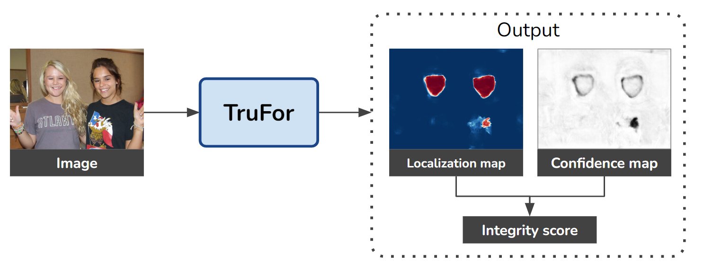
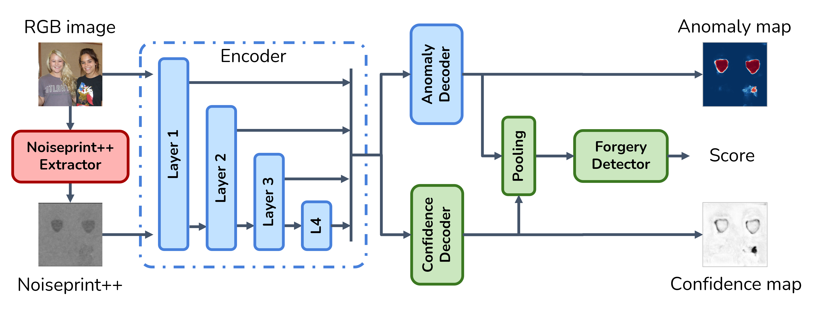

# TruFor

[](https://grip-unina.github.io/TruFor)
[](https://doi.org/10.48550/arXiv.2212.10957)
[](https://www.grip.unina.it)

Official PyTorch implementation of the paper "TruFor: Leveraging all-round clues for trustworthy image forgery detection and localization"

<p align="center">
 
</p>

## News
*   TODO: release Noiseprint++ training code
*   2025-03-05: Training code is now available
*   2023-06-28: Test code is now available
*   2023-02-27: Paper has been accepted at CVPR 2023
*   2022-12-21: Paper has been uploaded on arXiv


## Overview

**TruFor** is a forensic framework that can be applied to a large variety of image manipulation methods, from classic cheapfakes to more recent manipulations based on deep learning. We rely on the extraction of both high-level and low-level traces through a transformer-based fusion architecture that combines the RGB image and a learned noise-sensitive fingerprint. The latter learns to embed the artifacts related to the camera internal and external processing by training only on real data in a self-supervised manner. Forgeries are detected as deviations from the expected regular pattern that characterizes each pristine image. Looking for anomalies makes the approach able to robustly detect a variety of local manipulations, ensuring generalization. In addition to a pixel-level **localization map** and a whole-image **integrity score**, our approach outputs a **reliability map** that highlights areas where localization predictions may be error-prone. This is particularly important in forensic applications in order to reduce false alarms and allow for a large scale analysis. Extensive experiments on several datasets show that our method is able to reliably detect and localize both cheapfakes and deepfakes manipulations outperforming state-of-the-art works.


## Architecture

<center>  </center>

We cast the forgery localization task as a supervised binary segmentation problem, combining high-level (**RGB**) and low-level (**Noiseprint++**) features using a cross-modal framework.


## Docker Setup (inference only)

Follow the instructions in the README.md in the test_docker folder.


## CocoGlide dataset

You can download the CocoGlide dataset [here](https://www.grip.unina.it/download/prog/TruFor/CocoGlide.zip).


## License

Copyright (c) 2023 Image Processing Research Group of University Federico II of Naples ('GRIP-UNINA'). 

All rights reserved.

This software should be used, reproduced and modified only for informational and nonprofit purposes.

By downloading and/or using any of these files, you implicitly agree to all the
terms of the license, as specified in the document LICENSE.txt
(included in this package) 


## Bibtex
 
 ```
 @InProceedings{Guillaro_2023_CVPR,
    author    = {Guillaro, Fabrizio and Cozzolino, Davide and Sud, Avneesh and Dufour, Nicholas and Verdoliva, Luisa},
    title     = {TruFor: Leveraging All-Round Clues for Trustworthy Image Forgery Detection and Localization},
    booktitle = {Proceedings of the IEEE/CVF Conference on Computer Vision and Pattern Recognition (CVPR)},
    month     = {June},
    year      = {2023},
    pages     = {20606-20615}
}
```


## Acknowledgments
 
We gratefully acknowledge the support of this research by the Defense Advanced Research Projects Agency (DARPA) under agreement number FA8750-20-2-1004. 
The U.S. Government is authorized to reproduce and distribute reprints for Governmental purposes notwithstanding any copyright notation thereon.
The views and conclusions contained herein are those of the authors and should not be interpreted as necessarily representing the official policies or endorsements, either expressed or implied, of DARPA or the U.S. Government.

In addition, this work has received funding by the European Union under the Horizon Europe vera.ai project, Grant Agreement number 101070093, and is supported by Google and by the PREMIER project, funded by the Italian Ministry of Education, University, and Research within the PRIN 2017 program.
Finally, we would like to thank Chris Bregler for useful discussions and support.
